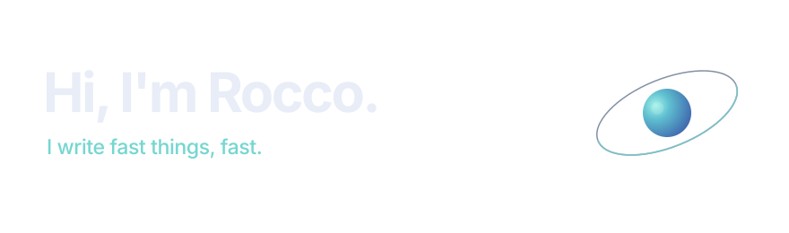

  

  2026 CS Graduate | I enjoy writing extremely optimized code to the point of obsession. Embedded programming, applied robotics, agentic simulations; I hope to work in the space industry one day.

  I work with <strong>C++ · Rust · Python · TypeScript · Java</strong>.

## Research papers

- I coauthored [Benchmarking Arbitrary Natural Language Tasks in 3D Open Worlds](https://embodied-ai.org/papers/2025/15_Benchmarking_Arbitrary_Natu.pdf) (CVPR 2025 Embodied AI Workshop) and contributed to [SemanticSteve](https://github.com/sonnygeorge/semantic-steve), the Minecraft agent library used in the paper.

## College research

- **Robotics · [HeRo Lab](https://herolab.org/):** I researched heterogeneous robot systems at UGA.
- **Space systems · [Small Satellite Research Laboratory](https://smallsat.uga.edu/):** I worked on small-satellite research at UGA.

## Minecraft

- **Physics & navigation:** [Rust Minecraft physics](https://github.com/GenerelSchwerz/rust-minecraft-physics) · [Mineflayer physics utilities](https://github.com/nxg-org/mineflayer-physics-utils) · [Minecraft Pathfinding](https://github.com/Minecraft-Pathfinding)
- **Bedrock:** [Prismarine Bedrock](https://github.com/deepslate-bedrock/prismarine-bedrock) · [Mineflayer Bedrock](https://github.com/GenerelSchwerz/mineflayer-bedrock)
- **Bot tooling:** [nxg-org](https://github.com/nxg-org) · [Static state machine](https://github.com/GenerelSchwerz/mineflayer-static-statemachine)

## Misc

- [llama.cpp fork](https://github.com/GenerelSchwerz/llama.cpp) · [Trajectory solver](https://github.com/GenerelSchwerz/trajectory-solver)
