  

  I’m a computer science graduate. I build useful tools and explore how systems fit together.

  I work with <strong>C++ · Rust · Python · TypeScript · Java</strong>.

  <a href="https://github.com/GenerelSchwerz/rust-minecraft-physics">Rust Minecraft physics</a>
  &nbsp;·&nbsp;
  <a href="https://github.com/GenerelSchwerz/trajectory-solver">Trajectory solver</a>

